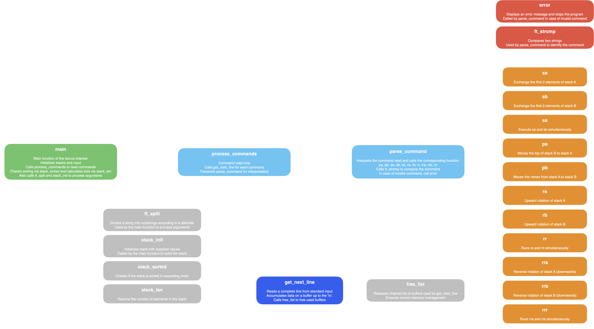

<p align="left">
  <a href="#--------push_swap--">🇬🇧 English</a> |
  <a href="#--------push_swap---1">🇫🇷 Français</a>
</p>

<h1 align="center">
  <br>
  
  <br>
  push_swap
  <br>
</h1>

<h4 align="center"><em>A program that sorts a list of integers using two stacks and a limited set of operations, optimizing the number of moves.</em></h4>

<p align="center">
  
  
  
</p>

<p align="center">
  <a href="https://drive.google.com/file/d/1_xP6Kx5EVuJmkRY_yCHHYgpSykoPb1yg/view?usp=sharing">Subject</a> |
  <a href="#-project-overview">Overview</a> •
  <a href="#-code-architecture-and-organization">Architecture</a> •
  <a href="#-sorting-algorithm">Algorithm</a> •
  <a href="#%EF%B8%8F-compilation-and-testing">Compilation</a>
</p>

---

## 📌 **Project overview**
The goal of **push_swap** is to sort a list of integers using only a series of operations on two stacks (A and B). The operations available are:
- **`swap`**: Swap the first two elements of a stack.
- **`push`**: Move the first element of one stack to the other.
- **`rotate`**: Shift upwards (the first elements become the last).
- **`reverse_rotate`**: Shift downwards (the last element becomes the first).

The algorithm implements several strategies to minimize the total number of moves.

The project also includes a bonus section (checker) to verify that the sorting has been carried out correctly, based on a series of commands.

---

## 📂 **Code architecture and organization**


#### 🔹 `push_swap.h`
- Definition of the **`t_stack_node`** structure to represent a stack node.
- Definition of **`t_calc`** structure for cost calculation.
- Prototypes of all functions used.

#### 🔹 `main.c`
- Program entry point.
- Checks arguments and uses `ft_split` if input arguments come from a single argument.
- Choose between a specific sort `tiny_sort` or a complete sort `push_swap`.

#### 🔹 `stack_init.c`
| Function | Description |
|----------|------------|
| `stack_init` | Parse and validate arguments, build stack A with `append_node` and call `error_free` in case of errors (syntax, duplicates). |
| `ft_atol` | Convert string to long. |

#### 🔹 `stack_utils.c`
| Function | Description |
|----------|------------|
| `find_last_node` | Returns the last node of a stack. |
| `append_node` | Adds a new node to the end of a stack. |
| `find_smallest` | Finds and returns the node with the smallest value in a stack. |
| `return_cheapest` | Scans stack B and returns the node marked as the cheapest (with the lowest push_price). |
| `stack_len` | Returns stack length (number of nodes). |

#### 🔹 `push_swap_init.c`, `target.c`
| Function | Description |
|----------|------------|
| `set_current_position` | Assigns a position (index) to each node in a stack. It also determines whether a node is above the median (useful for orienting rotations). |
| `set_target_node` | For each node in stack B, assigns the target node in stack A (the node to which the node will be “attached” when pushed into A). If no node is found, `find_smallest` is used. |
| `get_target_node` | Search in A for the node with the minimum value greater than that of B. |
| `set_price` | Calculates the cost (number of moves required) for each node in stack B to be pushed into A by calling `update_optimal_price`. |
| `set_cheapest` | Among all the nodes in stack B, determine the one with the lowest cost (`push_price`) and mark it as the cheapest (the ideal candidate to be moved first). |
| `init_nodes` | Function that groups all indexing and assignments (position, target, cost...) on all stacks. |

#### 🔹 `set_price.c`
| Function | Description |
|----------|------------|
| `set_initial_z_m` | Initializes the cost (z) and method (m) of moving a node. The initial cost is defined as the maximum value between the node's position in B and the position of its target in A. |
| `update_method_2`, `update_method_3`, `update_method_4` | Calculate cost alternatively if different rotation strategies are applied. |
| `update_optimal_price` | Iterates over all nodes of B to determine the best (most economical) strategy for each, and saves the results. |

#### 🔹 `tiny_sort.c`
| Function | Description |
|----------|------------|
| `stack_sorted` | Checks whether the stack is sorted. If it is not sorted, the `main` function calls the sorting functions. |
| `find_highest` | Returns the node with the highest value. |
| `tiny_sort` | Sort for 3 elements. Ensures that the largest element is last. Swap position of first 2 elements if necessary. |
| `handle_five` | Moves some nodes from A to B. Leaves 3 elements in A sorted with `tiny_sort` |

#### 🔹 `push_swap_command.c`
| Function | Description |
|----------|------------|
| `push_swap` | Sort entry point. Orders steps: initialize, separate, merge and adjust. |
| `move_nodes` | Orders nodes to be moved from stack B to A. Uses calculated cost and optimized rotations to select the element to be moved and synchronizes rotations accordingly. |
| `finish_rotation` | Performs the final rotations on stack A. Positions the smallest element at the top to finish sorting. |

#### 🔹 `swap_command.c`, `push_command.c`, `rotate_command.c`, `reverse_rotate_command.c`
| Command | Description |
|----------|------------|
| `push_command` | Transfers top node from one stack to another. |
| `rotate_command` | Rotation: 1st element becomes last. |
| `reverse_rotate_command` | Reverse rotation: last element becomes first. |
| `swap_command` | Swap the first 2 elements of stack A or B. |
| `sa` | Swap first two elements of stack **A**. |
| `sb` | Exchange the first two elements of stack **B**. |
| `ss` | Executes `sa` and `sb` simultaneously. |
| `pa` | Moves the first element of the **B** stack to the **A** stack. |
| `pb` | Moves the first element of the **A** stack to the **B** stack. |
| `ra` | Rotates **A** stack upwards (first becomes last). |
| `rb` | Rotate up stack **B** (first becomes last). |
| `rr` | Executes `ra` and `rb` simultaneously. |
| `rra` | Reverse (downward) rotation of stack **A** (last becomes first). |
| `rrb` | Reverse rotation (down) of stack **B** (last becomes first). |
| `rrr` | Executes `rra` and `rrb` simultaneously. |

#### 🔹 `rotations.c`
| Function | Description |
|----------|------------|
| `rotate_both_up` | Simultaneously rotates both stacks upwards, then continues if one of the stacks is still to rotate. |
| `rotate_both_down` | Same principle for downward rotations. |
| `rotate_b_up_a_down` and `rotate_b_down_a_up` | Handle combined reverse rotations according to calculated costs. |

#### 🔹 `error_free.c`
| Function | Description |
|----------|------------|
| `free_matrix` | Frees `**argv` if input arguments come from a single argument. |
| `free_stack` | Free all nodes in the stack. |
| `error_free` | Frees memory and displays `Error\n` on `stderr`, then `exit(1)`. |
| `error_syntax` | Checks that the string represents a valid integer (signs, digits). |
| `error_repetition` | Scan the stack to detect if a number is already present. |

## 🚀 Bonus



The checker is a complementary program that checks whether a sequence of operations applied to stacks A and B results in a correct sort:
- It initializes stack A with the numbers given as arguments.
- It reads the commands supplied as standard input, either manually typed or generated by `push_swap`.
- Each command is analyzed and executed on the stacks.

Once all commands have been processed :
- If stack A is sorted in ascending order and stack B is empty, it displays `OK`.
- Otherwise, it displays `KO`, indicating that the sorting is incorrect.

| Function | Description |
|----------|------------|
| `main` | Main function of the checker. Initializes stacks and input. Calls `process_commands` to read commands. Checks sorting via `stack_sorted` and calculates size via `stack_len`. Also calls `ft_split` and `stack_init` to process arguments. |
| `parse_command` | Interprets the command read and calls the corresponding function: `pa`, `pb`, `sa`, `sb`, `ss`, `ra`, `rb`, `rr`, `rra`, `rrb`, `rrr`. Call `ft_strcmp` to compare the command. In case of invalid command, call `error` |
| `error` | Displays an error message and stops the program in the event of an invalid command.
| `ft_strcmp` | Compares two strings. Used to identify a command. |
| `process_commands` | Read command loop. Calls `get_next_line` for each command. Passes command to `parse_command` for interpretation. |
| `free_list` | Frees chained list of buffers used by `get_next_line`. Ensures correct memory management. |
| `get_next_line` | Reads a complete line from standard input. Accumulates data in buffer until ``n``. Calls `free_list` to free used buffers. |

---

## 🏛 Sorting algorithm
The algorithm consists of several distinct steps to minimize the number of movements:

### 🔸 **Step 1️⃣: Initializing and indexing stacks**

- #### Creation and filling of stacks:
  Stack A is filled from input arguments, and stack B is initially empty.
- #### Indexing - `set_current_position`:
  Once the stack has been built, each node is assigned an index (`current_position`) corresponding to its position in the chained list.

#### ✅ Utility:
Allows you to find out how far a node is from the top of the stack.

#### 🛠️ How it works:
  - The stack is traversed from the beginning.
  - A counter is incremented and assigned to each node.
  - An `above_median` flag is also assigned (true if the position is less than or equal to half the total size).

---

### 🔸 **Step 2️⃣: Assigning targets (`target_node`) for stack B**.
#### 🎯 Objective:
When we're going to push a node from B to A, we need to know exactly where to insert it in A in order to keep the ascending order.

#### 🛠️ How it works:
For each node in B, we look for a node in A whose value is strictly greater than that of the node in B.

#### `get_target_node`:
- Scans the A stack, looking for the node with the smallest value greater than that of B.
- If no node matches (i.e. all nodes in A are smaller), the function returns `NULL`.
- In `set_target_node`, if `get_target_node` returns `NULL`, then the target node becomes the smallest node in A (obtained by `find_smallest`).

#### ✅ Utility:
This mechanism ensures that when a node from B is pushed into A, it moves to exactly the position it needs to occupy to maintain the sorted order.

---

### 🔸 **Step 3️⃣: Calculating moving costs**

#### 🎯 Objective:
Determine for each node in B the number of moves (rotations) required for that node to be moved in A to the correct position.

#### 🛠️ How it works:
- **`set_initial_z_m`** :
  - Sets an initial cost, which is the maximum between the node's current position in B and the position of its target in A.
  - Sets the initial method to 1.
- **`update_method_2`**, **`update_method_3`**, **`update_method_4`** :
  - Each function calculates the total cost by considering alternative rotations:
    - **Method 2**: Considers rotation from the bottom of B and rotation from the bottom of A.
    - **Method 3**: Combines an upward rotation of B and a downward rotation of A.
    - **Method 4**: Combines a downward rotation of B and an upward rotation of A.
- **`update_optimal_price`**:
  - For each node of B, the three alternative methods are evaluated.
  - The method with the lowest cost is retained (by updating `calc->z` and `calc->m`).
  - The minimum cost is then stored in the `push_price` field of B's node, and the method (rotation to be applied) in `rotation_method`.

#### ✅ Utility:
This allows you to choose the node whose move will be the least costly (from an operational point of view) to be processed first.

---

### 🔸 **Step 4️⃣: Select optimal movements and merge stacks**

#### 🛠️ How it works :
The `return_cheapest` function scans stack B to find the node marked as the least expensive (the one with the lowest `push_price`).
Once this node has been identified, the program refers to its `rotation_method` to determine how to rotate stacks A and B synchronously.

#### 🔄 Using rotation functions:
- **`rotate_both_up`** and **`rotate_both_down`**:
  Enable both stacks to be rotated simultaneously in the same direction when costs (number of rotations) are comparable.
- **`rotate_b_up_a_down`** and **`rotate_b_down_a_up`**:
  Handle the case where the rotations to be applied in A and B are in opposite directions.

#### ✅ Final action :
After applying the appropriate rotations, the `pa` command is executed to push the selected node from B to A.

---

### 🔸 **Step 5️⃣: Final adjustment of the A stack**

#### 🎯 Objective:
Once all the nodes have been put back into A, we need to ensure that the smallest element ends up at the top of the stack to achieve a complete sort.

#### 🛠️ How it works:
- The smallest node in A is identified (`find_smallest`).
- Depending on its position (determined by `above_median`), the stack is rotated either upwards (`ra`) or downwards (`rra`) until the smallest node is at the top.

---

## ⚙️ **Compilation and testing**

### 🔧 Compiling
- To compile **push_swap**:
  ```bash
  make
  ```
- To compile **checker**:
  ```bash
  make bonus
  ```
- To delete object files:
  ```bash
  make clean
  ```
- To delete object files and compiled binaries :
  ```bash
  make fclean
  ```

---

### ▶️ Use and execution

- #### ✅ Executing `push_swap`:
  The **`push_swap`** executable takes as argument a sequence of integers:
    ```bash
    ./push_swap 4 67 3 87 23
    ```
    ```bash
    ./push_swap “4 67 3 87 23”
    ```
    ```bash
    ARG=“4 67 3 87 23”; ./push_swap $ARG
    ```
  The output will be a series of commands (each command on a line) which, when applied, sort the list.

- #### 🚀 Using the `checker` (bonus):
  The `checker` bonus program reads commands generated by `push_swap` (or those supplied manually) and executes them on stacks initialized with the same integer list:
    ```bash
    ./push_swap 4 67 3 87 23 | ./checker 4 67 3 87 23
    ```
    ```bash
    ARG=“4 67 3 87 23”; ./push_swap $ARG | ./checker $ARG
    ```
  If correctly sorted, checker will display `OK`, otherwise `KO`.

---

<h1 align="center">
  <br>
  
  <br>
  push_swap
  <br>
</h1>

<h4 align="center"><em>Un programme qui trie une liste d'entiers en utilisant deux stacks et un ensemble limité d'opérations, en optimisant le nombre de mouvements.</em></h4>

<p align="center">
  
  
  
</p>

<p align="center">
  <a href="https://drive.google.com/file/d/1_JgCeIF_SzWlPaZwJnjbB6sK25cNOss5/view?usp=sharing">Sujet</a> |
  <a href="#-présentation-générale-du-projet">Présentation</a> •
  <a href="#-architecture-et-organisation-du-code">Architecture</a> •
  <a href="#-algorithme-detri">Algorithme</a> •
  <a href="#%EF%B8%8F-compilation-et-tests">Compilation</a>
</p>

---

## 📌 **Présentation générale du projet**
Le but de **push_swap** est de trier une liste d’entiers uniquement à l’aide d’une série d’opérations sur deux stacks (A et B). Les opérations disponibles sont:
- **`swap`**: Échanger les deux premiers éléments d'une pile.
- **`push`**: Déplacer le premier élément d’une pile vers l’autre.
- **`rotate`**: Décaler vers le haut (les premiers éléments deviennent les derniers).
- **`reverse_rotate`**: Décaler vers le bas (le dernier élément devient le premier).

L’algorithme met en œuvre plusieurs stratégies afin de minimiser le nombre total de mouvements.

Ce projet comporte également une partie bonus (checker) permettant de vérifier, à partir d’une série de commandes, que le tri a été réalisé correctement.

---

## 📂 **Architecture et organisation du code**


#### 🔹 `push_swap.h`
- Définition de la structure **`t_stack_node`** pour représenter un nœud de pile.
- Définition de la structure **`t_calc`** pour le calcul du coût.
- Prototypes de toutes les fonctions utilisées.

#### 🔹 `main.c`
- Point d’entrée du programme.
- Vérifie les arguments et utilise `ft_split` si les arguments d’entrée proviennent d'un seul argument.
- Choisi entre un tri spécifique `tiny_sort` ou un tri complet `push_swap`.

#### 🔹 `stack_init.c`
| Fonction | Description |
|----------|------------|
| `stack_init` | Parse et valide les arguments, construit la stack A avec `append_node` et appelle `error_free` en cas d’erreur (syntaxe, doublons). |
| `ft_atol` | Converti une chaîne de caractères en long. |

#### 🔹 `stack_utils.c`
| Fonction | Description |
|----------|------------|
| `find_last_node` | Renvoie le dernier nœud d’une stack. |
| `append_node` | Ajoute un nouveau nœud à la fin d’une stack. |
| `find_smallest` | Recherche et retourne le nœud ayant la plus petite valeur dans une stack. |
| `return_cheapest` | Parcourt la stack B et retourne le nœud marqué comme le moins cher (avec le plus faible push_price). |
| `stack_len` | Renvoie la longueur d’une pile (le nombre de nœuds). |

#### 🔹 `push_swap_init.c`, `target.c`
| Fonction | Description |
|----------|------------|
| `set_current_position` | Affecte une position (index) à chaque nœud d’une pile. Elle détermine également si un nœud est au-dessus de la médiane (utile pour orienter les rotations). |
| `set_target_node` | Pour chaque nœud de la stack B, assigne le nœud cible dans la stack A (le nœud auquel le nœud sera "attaché" lorsqu’il sera push dans A). Si aucun nœud n’est trouvé, `find_smallest` est utilisé. |
| `get_target_node` | Recherche dans A, le nœud ayant la valeur minimale supérieure à celle de B. |
| `set_price` | Calcule le coût (nombre de mouvements requis) pour chaque nœud de la stack B afin d’être push dans A en appelant `update_optimal_price`. |
| `set_cheapest` | Parmi tous les nœuds de la pile B, détermine celui dont le coût (`push_price`) est le plus bas et le marque comme étant le plus cheap (le candidat idéal pour être déplacé en premier). |
| `init_nodes` | Fonction regroupant l’ensemble de l’indexation et des affectations (position, cible, coût...) sur toutes les stacks. |

#### 🔹 `set_price.c`
| Fonction | Description |
|----------|------------|
| `set_initial_z_m` | Initialise le coût (z) et méthode (m) de déplacement pour un nœud. Le coût initial est défini comme la valeur maximale entre la position du nœud dans B et la position de sa cible dans A. |
| `update_method_2`, `update_method_3`, `update_method_4` | Calculent alternativement le coût si différentes stratégies de rotations sont appliquées. |
| `update_optimal_price` | Itère sur l’ensemble des nœuds de B pour déterminer la meilleure stratégie (la plus économique) pour chacune d’entre elles et enregistre les résultats. |

#### 🔹 `tiny_sort.c`
| Fonction | Description |
|----------|------------|
| `stack_sorted` | Vérifie si la stack est triée. Si elle n'est pas triée, la fonction `main` appelle les fonctions de tri. |
| `find_highest` | Retourne le noeud de valeur maximale. |
| `tiny_sort` | Tri pour 3 éléments. S’assure que le plus grand élément est en dernier. Swap les position des 2 premiers éléments si nécessaire |
| `handle_five` | Déplace certains noeuds de A vers B. Laisse 3 éléments dans A triés avec `tiny_sort` |

#### 🔹 `push_swap_command.c`
| Fonction | Description |
|----------|------------|
| `push_swap` | Point d’entrée tri. Ordonne les étapes : initialisation, séparation, fusion et ajustement. |
| `move_nodes` | Ordonne le déplacement des noeuds de la stack B vers A. Utilise le coût calculé et les rotations optimisées pour sélectionner l’élément à déplacer et synchronise les rotations en conséquence. |
| `finish_rotation` | Effectue les rotations finales sur la stack A. Positionne le plus petit élément en haut pour terminer le tri. |

#### 🔹 `swap_command.c`, `push_command.c`, `rotate_command.c`, `reverse_rotate_command.c`
| Commande | Description |
|----------|------------|
| `push_command` | Transfère le noeud du haut d’une stack vers l’autre. |
| `rotate_command` | Rotation: le 1er élément devient le dernier. |
| `reverse_rotate_command` | Rotation inverse: le dernier élément devient le premier. |
| `swap_command` | Échange les 2 premiers élements de la stack A ou B. |
| `sa` | Échange les deux premiers éléments de la pile **A**. |
| `sb` | Échange les deux premiers éléments de la pile **B**. |
| `ss` | Exécute `sa` et `sb` simultanément. |
| `pa` | Déplace le premier élément de la pile **B** vers la pile **A**. |
| `pb` | Déplace le premier élément de la pile **A** vers la pile **B**. |
| `ra` | Rotation vers le haut de la stack **A** (le premier devient dernier). |
| `rb` | Rotation vers le haut de la stack **B** (le premier devient dernier). |
| `rr` | Exécute `ra` et `rb` simultanément. |
| `rra` | Rotation inverse (vers le bas) de la stack **A** (le dernier devient premier). |
| `rrb` | Rotation inverse (vers le bas) de la stack **B** (le dernier devient premier). |
| `rrr` | Exécute `rra` et `rrb` simultanément. |

#### 🔹 `rotations.c`
| Fonction | Description |
|----------|------------|
| `rotate_both_up` | Effectue simultanément une rotation vers le haut sur les deux piles, puis poursuit si l’une des piles doit encore tourner. |
| `rotate_both_down` | Même principe pour les rotations vers le bas. |
| `rotate_b_up_a_down` et `rotate_b_down_a_up` | Gèrent des rotations combinées inverses selon les coûts calculés. |

#### 🔹 `error_free.c`
| Fonction | Description |
|----------|------------|
| `free_matrix` | Libère `**argv` si les arguments d’entrée proviennent d’un seul argument. |
| `free_stack` | Libère tous les noeuds de la stack. |
| `error_free` | Libère la mémoire et affiche `Error\n` sur `stderr`, puis `exit(1)`. |
| `error_syntax` | Vérifie que la chaîne représente un entier valide (signes, chiffres). |
| `error_repetition` | Parcours la stack pour détecter si un nombre est déjà présent. |

## 🚀 Bonus


Le checker est un programme complémentaire qui permet de vérifier si une séquence d'opérations appliquée sur les stacks A et B aboutit à un tri correct:
- Il initialise la stack A avec les nombres donnés en argument.
- Il lit les commandes fournies en entrée standard, soit tapées manuellement, soit générées par `push_swap`.
- Chaque commande est analysée et exécutée sur les stacks.

Une fois toutes les commandes traitées :
- Si la stack A est triée en ordre croissant et que la stack B est vide, il affiche `OK`.
- Sinon, il affiche `KO`, indiquant que le tri est incorrect.

| Fonction | Description |
|----------|------------|
| `main` | Fonction principale du checker. Initialise les stacks et l’entrée. Appelle `process_commands` pour lire les commandes. Vérifie le tri via `stack_sorted` et calcule la taille via `stack_len`. Appelle aussi `ft_split` et `stack_init` pour traiter les arguments. |
| `parse_command` | Interprète la commande lue et appelle la fonction correspondante: `pa`, `pb`, `sa`, `sb`, `ss`, `ra`, `rb`, `rr`, `rra`, `rrb`, `rrr`. Appelle `ft_strcmp` pour comparer la commande. En cas de commande invalide, appelle `error` |
| `error` | Affiche un message d’erreur et arrête le programme en cas de commande invalide. |
| `ft_strcmp` | Compare deux chaînes de caractères. Utilisé pour identifier une commande. |
| `process_commands` | Boucle de lecture des commandes. Appelle `get_next_line` pour chaque commande. Transmet la commande à `parse_command` pour interprétation. |
| `free_list` | Libère la liste chaînée de buffers utilisés par `get_next_line`. Assure une gestion correcte de la mémoire |
| `get_next_line` | Lit une ligne complète depuis l’entrée standard. Accumule les données sur un buffer jusqu'au `\n`. Appelle `free_list` pour libérer les buffers utilisés |

---

## 🏛 Algorithme de tri
L’algorithme s’inscrit en plusieurs étapes distinctes pour minimiser le nombre de mouvements :

### 🔸 **Étape 1️⃣: Initialisation et indexation des stacks**

- #### Création et remplissage des stacks:
  La stack A est remplie à partir des arguments d’entrée, et la stack B est initialement vide.
- #### Indexation – `set_current_position`:
  Une fois la stack construite, chaque nœud se voit attribuer un indice (`current_position`) qui correspond à sa position dans la liste chaînée.

#### ✅ Utilité:
Permet de connaître la distance d’un nœud par rapport au sommet de la stack.

#### 🛠️ Fonctionnement:
  - La stack est parcourue depuis le début.
  - Un compteur est incrémenté et assigné à chaque nœud.
  - Un flag `above_median` est aussi affecté (vrai si la position est inférieure ou égale à la moitié de la taille totale).

---

### 🔸 **Étape 2️⃣: Affectation des cibles (`target_node`) pour la stack B**
#### 🎯 Objectif:
Quand on va pousser un nœud depuis B vers A, il faut savoir exactement à quel endroit l’insérer dans A afin de conserver l’ordre croissant.

#### 🛠️ Fonctionnement:
Pour chaque nœud dans B, on cherche un nœud dans A dont la valeur est strictement supérieure à celle du nœud de B.

#### `get_target_node`:
- Parcourt la stack A en cherchant le nœud avec la plus petite valeur supérieure à celle de B.
- Si aucun nœud ne correspond (càd tous les nœuds de A sont inférieurs), la fonction retourne `NULL`.
- Dans `set_target_node`, si `get_target_node` retourne `NULL`, alors le nœud cible devient le nœud le plus petit de A (obtenu par `find_smallest`).

#### ✅ Utilité:
Ce mécanisme assure que lorsqu’un nœud de B est poussé dans A, il se place exactement à la position qu’il doit occuper pour maintenir l’ordre trié.

---

### 🔸 **Étape 3️⃣: Calcul du coût de déplacement**

#### 🎯 Objectif:
Déterminer pour chaque nœud dans B le nombre de mouvements (rotations) nécessaires pour que ce nœud soit déplacé dans A à la bonne position.

#### 🛠️ Fonctionnement:
- **`set_initial_z_m`** :
  - Fixe un coût initial, qui est le maximum entre la position actuelle du nœud dans B et la position de sa cible dans A.
  - Fixe la méthode initiale à 1.
- **`update_method_2`**, **`update_method_3`**, **`update_method_4`** :
  - Chaque fonction calcule le coût total en considérant des rotations alternatives:
    - **Methode 2** : Considère la rotation depuis le bas de B et la rotation depuis le bas de A.
    - **Methode 3** : Combine une rotation de B vers le haut et A vers le bas.
    - **Methode 4** : Combine une rotation de B vers le bas et A vers le haut.
- **`update_optimal_price`** :
  - Pour chaque nœud de B, les trois méthodes alternatives sont évaluées.
  - La méthode qui donne le coût le plus faible est conservée (en mettant à jour `calc->z` et `calc->m`).
  - Le coût minimal est alors stocké dans le champ `push_price` du nœud de B et la méthode (rotation à appliquer) dans `rotation_method`.

#### ✅ Utilité :
Cela permet de choisir le nœud dont le déplacement sera le moins coûteux (d’un point de vue opérationnel) pour être traité en priorité.

---

### 🔸 **Étape 4️⃣: Sélection des mouvements optimaux et fusion des stacks**

#### 🛠️ Fonctionnement :
La fonction `return_cheapest` parcourt la stack B pour trouver le nœud marqué comme le moins coûteux (celui avec le plus petit `push_price`).
Une fois ce nœud identifié, le programme se réfère à son `rotation_method` pour déterminer comment faire pivoter les stacks A et B de manière synchronisée.

#### 🔄 Utilisation des fonctions de rotation :
- **`rotate_both_up`** et **`rotate_both_down`**:
  Permettent de faire tourner les deux piles en même temps dans la même direction quand les coûts (nombre de rotations) sont comparables.
- **`rotate_b_up_a_down`** et **`rotate_b_down_a_up`**:
  Gèrent le cas où les rotations à appliquer dans A et B sont dans des directions opposées.

#### ✅ Action finale :
Après avoir appliqué les rotations adéquates, la commande `pa` est exécutée pour pousser le nœud sélectionné de B vers A.

---

### 🔸 **Étape 5️⃣: Ajustement final de la stack A**

#### 🎯 Objectif:
Une fois que tous les nœuds ont été remis dans A, il faut faire en sorte que le plus petit élément se retrouve en haut de la stack pour obtenir un tri complet.

#### 🛠️ Fonctionnement:
- On identifie le nœud le plus petit de A (`find_smallest`).
- En fonction de sa position (déterminée par `above_median`), la stack est tournée soit vers le haut (`ra`) soit vers le bas (`rra`) jusqu’à ce que le nœud le plus petit se retrouve au sommet.

---

## ⚙️ **Compilation et tests**

### 🔧 Compilation
- Pour compiler **push_swap**:
  ```bash
  make
  ```
- Pour compiler le **checker**:
  ```bash
  make bonus
  ```
- Pour supprimer les fichiers objets:
  ```bash
  make clean
  ```
- Pour supprimer les fichiers objets et les binaires compilés :
  ```bash
  make fclean
  ```

---

### ▶️ Utilisation et exécution

- #### ✅ Exécution de `push_swap`:
  L’exécutable **`push_swap`** prend en argument une suite d’entiers:
    ```bash
    ./push_swap 4 67 3 87 23
    ```
    ```bash
    ./push_swap "4 67 3 87 23"
    ```
    ```bash
    ARG="4 67 3 87 23"; ./push_swap $ARG
    ```
  La sortie sera une série de commandes (chaque commande sur une ligne) qui, lorsqu’elles sont appliquées, trient la liste.

- #### 🚀 Utilisation du `checker` (bonus):
  Le programme bonus `checker` lit les commandes générées par `push_swap` (ou celles fournies manuellement) et les exécute sur des piles initialisées avec la même liste d’entiers:
    ```bash
    ./push_swap 4 67 3 87 23 | ./checker 4 67 3 87 23
    ```
    ```bash
    ARG="4 67 3 87 23"; ./push_swap $ARG | ./checker $ARG
    ```
  S’il est correctement trié, checker affichera `OK`, sinon `KO`.
